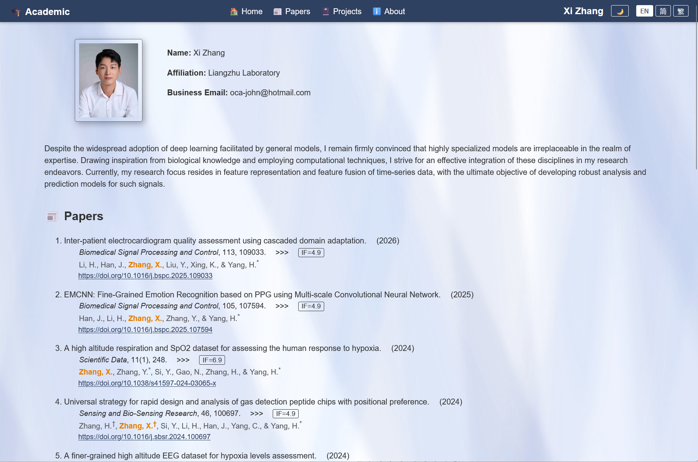
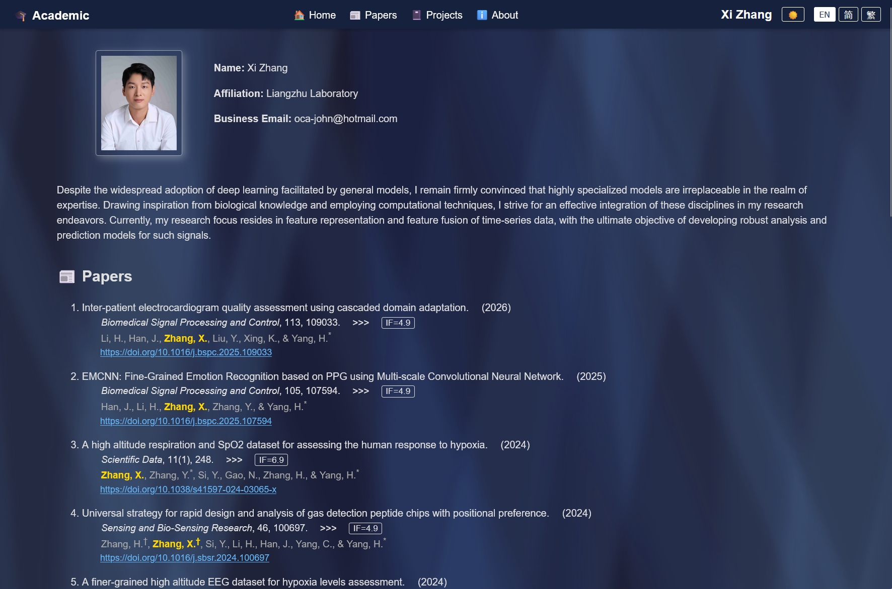

# 🎓 Academic

A personal academic homepage for Xi Zhang, featuring research publications, projects, and educational background.

## Features

- 🌓 Dark/Light theme toggle with smooth transitions
- 🌐 Multi-language support (English, 简体中文, 繁體中文)
- ✨ Animated aurora background effect
- 📱 Responsive design
- 🔗 Academic profile links (ORCID, Google Scholar, ResearchGate, PubMed, GitHub, LinkedIn)

<table border="0">
  <tr>
    <td align="center" valign="bottom">
      <a href="./imgs/page-light.png">
        
      </a>
      <br>
      <p align="center">亮色主题</p>
    </td>
    <td align="center" valign="bottom">
      <a href="./imgs/page-dark.png">
        
      </a>
      <br>
      <p align="center">暗色主题</p>
    </td>
  </tr>
</table>


## Pages

| Page | Description |
|------|-------------|
| `index.html` | Home page with profile, bio, papers overview, review experience, and projects |
| `papers.html` | Full list of publications with journal info and impact factors |
| `projects.html` | Research projects |
| `about.html` | Educational background and research experience |

## Project Structure

```
├── index.html          # Home page
├── papers.html         # Publications page
├── projects.html       # Projects page
├── about.html          # About page
├── settings.js         # Multi-language translations and theme toggle
├── imgs/               # Images and icons
│   ├── xizh-s.jpg      # Profile photo
│   ├── orcid.svg
│   ├── scholar.png
│   ├── researchgate.png
│   ├── pubmed.png
│   ├── github.png
│   ├── linkedin.png
│   └── twitter*.png
├── LICENSE
└── README.md
```

## Usage

Simply open `index.html` in a browser or deploy to any static hosting service (GitHub Pages, Netlify, etc.).

## License

MIT License

---

Built by Xi Zhang · November 2025
